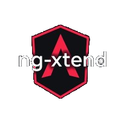

#  Examples

This mono-repository provides multiple examples of usage of ng-xtend framework.
Each example is a separate package containing an Angular application, adding a specific use case over the previous one.

## Description
The table below describes the different examples:

| Example                                | Description                                                                                                                                                                   | xt-render tag | Plugin type | Plugin Loading | Type system | Store |
|----------------------------------------|-------------------------------------------------------------------------------------------------------------------------------------------------------------------------------|----------------------|-------------|----------------|-------------|-------|
| [basic-example](basic)                 | Displays any object in various format in a generic way                                                                                                                        | Yes                  | Default     | Static         | No          | No    |
| [typed-example](typed)                 | By describing the type handled, ng-xtend supports more use cases                                                                                                              | Yes                  | Default     | Static         | Yes         | No    |
| [plugin-example](plugin)               | Countries and Money fields looks nicer thanks to the newly added plugins. They are discovered and used transparently by the ng-xtend framework                                | Yes                  | Custom      | Static         | Yes         | No    |
| [inout-example](inout)                 | A full list / edit / view flow is setup thanks to inputs / outputs connecting unknown components together.                                                                    | Yes                  | Custom      | Static         | Yes         | No    |
| [store-example](store)                 | Edited elements are persisted between sessions thanks to the xt-store library included with the ng-xtend framework.                                                           | Yes                  | Custom      | Static         | Yes         | Yes   |
| [advanced-type-example](advanced-type) | Showcase support for advanced types and models (like references)                                                                                                              | Yes                  | Default     | Static         | Advanced    | No    |
| [dynamic-example](Dynamic)             | Loads all plugins dynamically from another website using [Native-Federation](https://github.com/angular-architects/module-federation-plugin/tree/main/libs/native-federation) | Yes                  | Custom      | Dynamic        | Yes    | No    |

## Build
It is managed by [rush](https://rushjs.io), so you need to install rush globally,
then run `rush install` to install dependencies.

- The `rush build` command will build all packages.

Each package being an angular application, you can run `ng serve` to run them locally.
